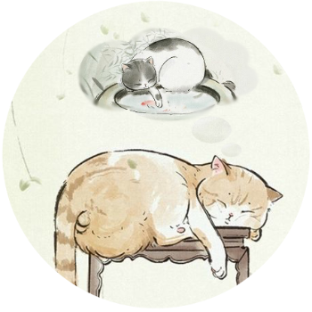

# Memacs

## Spacemacs 配置缩减计划进度
- 删除无用的 banner 和其他杂乱的图片，只留下我自己的 banner -- 羽川翼
- 删除无用的愚人节配置, 这个配置真无聊
- 删除向后兼容代码，现在最小支持版本为 emacs 26.0.9
- 删除 configuration-layer 函数，我到现在只写了四个 layer ， 预计1年内不会写新的 layer ，这个函数有什么用？
- 删除 report-issue ，从此我不再向 spacemacs 报 issue ， 直接 pull request
- 删除 private 文件夹 ，整个项目都是我的配置，不需要再区分 private
- 删除 tests 文件夹 ， 我不需要遵循他们的测试方式
- 删除 auto-layer 和 lazy install ，我要什么 layer 就直接去官方拿什么，不需要当前 lazy install 方式
- 删除所有我没用到的 layer 和没有任何用处的文档
- 删除 spacemacs.template 
- 修改 .spaceamcs 路径为 ~/.emacs.d/memacs ，且只能通过该路径
- 删除 非native全屏 方式，修复bug：启动时全屏会无法正常显示 home buffer 
- 删除 spacemacs 新版本确认
- 删除所有冗余的主题申明
- 删除默认微软字体定义，我不需要支持windows版emacs
- 删除所有没用的持续集成配置文件
- 删除github的issue和pull request文本文件
- 删除启动进度条
- 删除 quik help 和 release note 相关代码
- 删除 docs 和 faq 的查看，我比较喜欢直接去官网或github页面上看
- 删除 evil tutorial 
- 删除 golden-ratio mode , 它 bug 太多
- 修改许多 windows 相关绑定
- 删除 winum mode , 我从来都是用 ace-window 和 evil-window 的
- 删除 centered-buffer-mode , 这个东西只能用来装逼，而且效果还很差
- 删除 zone-mode , 这个mode莫名其妙，有屏保就够了
- 删除 helm 
- 瘦身搜索工具与函数
- 删除 ido, ido 只在 core 的 rollback package 中被使用，而我将它抽象为 completing-read-func 
- 将 spacemacs-completion 层与 ivy 层合并
- 将 window 相关指令绑定在 C-w 之下
- 将文本内容相关执行绑定在 C-s 之下， 将 clear-highlight 改为 gs ，将 iedit-mode 改为 gI
- 删除 gui-tab 相关的配置，这个用不到
- 删除 paste transient state， 有 counsel-yand 和 evil-register 了，这个多此一举
- 将 ivy-evil-regeisters 绑定到 C-e , 将 counsel-yank-pop 绑定到 C-y
- 将 navigation transient state 修改为 Page navigation transient state (SPC P)
- 将 goto-last-searched-ahs-symbol 修改为 gH
- 将 dracula-theme 作为内置主题
- 删除所有在 dotspacemacs-excluding-packages 中的包的相关配置
- 删除 auto-completion , 大家用的都是 company
- 整和我的键位绑定到相应的地方
- 将 spacemacs-editing 中的函数定义从 package 初始化中分离到 funcs.el
- 删除 link-hint 包，我只使用 spacemacs/avy-goto-url 和 spacemacs/avy-open-url
- 让 spacemacs-editing 中的 package 尽量 autoload
- 删除 holy-mode 和 dotspacemacs-editing-style ，我只使用 hybrid 
- 为 evil-iedit-state-mode 添加退出绑定，在取消高亮的 ‘gs’ 中
- 删除 spacemacs-buffer 页面的 mouse-1 绑定，它有bug
- 删除 hl-anything ， 3年前的issue到现在都没解决。。。。
- 删除 indent-guide ，它造成我的buffer抖动
- 删除 highlight-indentation-current-column ，太难看了
- 删除 rainbow-delimiters ，太慢
- 修改 highlight-paren 的颜色列表，太单调
- 删除 evil-clearparens 
- 分离 spacemacs-evil 的键位绑定到 keybindings.el
- 使 evil-numbers 和 evil-commenter autoload
- 删除 request 包，完全不知道这个包有什么用
- 删除 zoom-frm ，有bug

## License

[GPLv3](./LICENSE)
